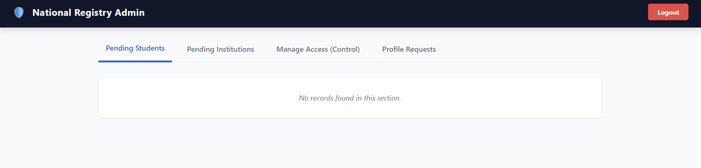
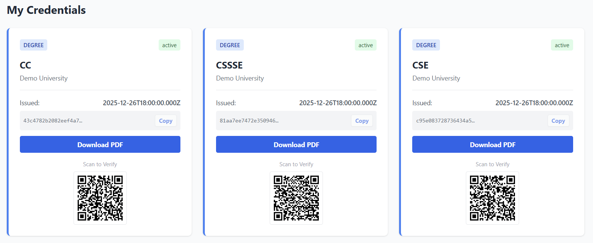

# 🎓 EduAuth Registry: Blockchain-Based Academic Verification System

  

## Introduction
EduAuth Registry is a centralized, privacy-focused academic verification platform that connects Students, Educational Institutions, and Recruiters through a trusted registry. It enforces admin governance for onboarding and sensitive profile changes, hashes identity numbers for privacy, and provides public verification with QR codes and downloadable PDF certificates.

> **Key Innovation:** EduAuth uses SHA-256 hashing for identity protection (NID/Birth Certificate) and certificate integrity, ensuring privacy while maintaining trust.

---

## 📸 Screenshots

| Admin Dashboard | Student Profile | Verified Certificate |
|:---:|:---:|:---:|
|  |  |  |

---

## 🚀 Key Features

### 🛡️ Secure Core
* **Privacy-First Identity:** NID/Birth Certificate numbers are hashed (SHA-256) before storage—even database administrators cannot see the original identity numbers.
* **Role-Based Access Control (RBAC):** Strict separation between Admin (Authority), Institutions, and Students with middleware-enforced permissions.

### 🏛️ Smart Governance
* **Approval Workflow:** All registrations start as `pending` and require manual Admin approval before activation.
* **Profile Lock:** Critical fields (Name, DoB, Identity, and Photo) are immutable after approval. Any changes require a formal Profile Change Request with supporting documents (e.g., Affidavit, Legal Name Change Certificate), which are reviewed and approved by Admins.
* **Institution Permissions:** Admins can grant or revoke certificate issuance permissions for institutions independently of account status.

### 🎓 Academic Workflow
* **Smart Enrollment:** Institutions can only issue credentials to students they have explicitly enrolled via hashed identity match, preventing unauthorized certificate issuance.
* **Rich Metadata:** Certificates store comprehensive academic data including CGPA, Major, Credit Hours, and Convocation Date.
* **Student Dashboard:** Students can view all their issued certificates, track profile change requests, and update non-critical contact information independently.

### ✅ Modern Verification
* **Instant Verification:** Public portal verifies certificates by hash without requiring login—accessible to recruiters and third parties.
* **QR Code Integration:** Dynamic QR codes embedded in certificates for instant mobile scanning and verification.
* **PDF Export:** High-quality, printable certificate downloads with tamper-proof hashes.

---

## 🛠️ Tech Stack

* **Frontend:** React.js, Tailwind CSS, Vite
* **Backend:** Node.js, Express.js
* **Database:** MySQL / MariaDB (Relational Schema with JSON support for metadata)
* **Security:** Bcrypt (Password Hashing), Crypto (NID Hashing), JWT (Session Management)
* **Utilities:** react-qr-code, html2canvas, jspdf (PDF Generation), nodemailer (Email Notifications)

---

## ⚙️ Installation & Setup

### Prerequisites
* Node.js (v16 or higher)
* MySQL Server (or MariaDB)

### Step 1: Database Setup
Import the schema to create the `eduauth_registry` database:
```bash
mysql -u root -p < database/schema.sql
```

### Step 2: Create Super Admin
Seed the Super Admin account with the default password `admin123`:
```sql
INSERT INTO users (user_id, email, password_hash, role, status, email_verified)
VALUES (
  UUID(),
  'admin@ugc.gov.bd',
  '$2b$10$KveaowE1.mJgWY6RJxI6e.lRZEF/jU4BJkyqBITHx8FFyAnzEDj8a', -- Hash for 'admin123'
  'admin',
  'active',
  1
);
```

> **Security Note:** Change the admin password immediately after first login in a production environment.

### Step 3: Backend Configuration
Create a `.env` file in the `backend/` directory:
```env
DB_HOST=localhost
DB_USER=root
DB_PASSWORD=
DB_NAME=eduauth_registry
PORT=5000
JWT_SECRET=super_secret_key_change_this_in_production

# Email Service (Optional: Required for email verification)
# To get Google App Password: https://support.google.com/accounts/answer/185833
SMTP_HOST=smtp.gmail.com
SMTP_PORT=587
SMTP_USER=your_email@gmail.com
SMTP_PASS=your_google_app_password
SMTP_FROM=EduAuth Registry <your_email@gmail.com>
SMTP_SECURE=false
APP_BASE_URL=http://localhost:5173
```

**Email Configuration Guide:**
1. Enable 2-Step Verification on your Google Account
2. Visit [Google App Passwords](https://myaccount.google.com/apppasswords)
3. Generate a new App Password for "Mail"
4. Use the 16-character password in `SMTP_PASS`

### Step 4: Run the Application
**Backend:**
```bash
cd backend
npm install
node server.js
```

**Frontend:**
```bash
cd frontend
npm install
npm run dev
```

The application will be accessible at `http://localhost:5173`.

---

## 🔄 Usage Workflow

**Complete Flow:** Register → Admin Approve → Enroll → Issue → Verify

1. **Registration:** Students and institutions register through the public portal (status: `pending`).
2. **Approval:** Admin reviews and approves accounts from the Admin Dashboard.
3. **Enrollment:** Institutions enroll students by searching their NID (system hashes and matches automatically).
4. **Credential Issuance:** Institutions issue certificates with academic metadata to enrolled students.
5. **Verification:** Public verification via certificate hash or QR code scan, with PDF download capability.

### Testing the System
1. Login as Admin (`admin@ugc.gov.bd` / `admin123`)
2. Open an incognito window and register a Student and an Institution
3. Return to Admin Dashboard and approve both registrations
4. Login as the Institution → Navigate to "My Students" → Search by NID → Click "Enroll"
5. Go to "Issue Certificate" → Select enrolled student → Fill academic details → Issue
6. Logout → Visit `/verify` → Enter certificate hash or scan QR code

---

## 📋 API Documentation

**Base URL:** `http://localhost:5000/api/v1`

### Authentication Endpoints
| Method | Endpoint | Description | Auth Required |
|--------|----------|-------------|---------------|
| POST | `/auth/register` | Register student/institution (multipart/form-data; students can upload `photo`) | No |
| POST | `/auth/login` | Login and receive JWT token | No |
| GET | `/auth/me` | Get current user data and permissions | Yes |

### Admin Endpoints
| Method | Endpoint | Description | Auth Required |
|--------|----------|-------------|---------------|
| GET | `/admin/pending?type=student\|institution` | Get pending registrations by type | Admin |
| PUT | `/admin/approve/:userId` | Approve user registration | Admin |
| GET | `/admin/institutions` | List all institutions with permission status | Admin |
| PUT | `/admin/permission/:userId` | Toggle certificate issuance permission for institution | Admin |
| GET | `/admin/profile-requests` | Get all pending profile change requests | Admin |
| POST | `/admin/profile-requests/:requestId/decision` | Approve/reject profile request (body: `action`, `comment`) | Admin |

### Institution Endpoints
| Method | Endpoint | Description | Auth Required |
|--------|----------|-------------|---------------|
| POST | `/institution/enroll` | Enroll student by NID (backend hashes before lookup) | Institution |
| GET | `/institution/students` | Get list of enrolled students | Institution |
| POST | `/certificates/issue` | Issue certificate to enrolled student | Institution |

### Student Endpoints
| Method | Endpoint | Description | Auth Required |
|--------|----------|-------------|---------------|
| GET | `/students/me/certificates` | Get all issued certificates | Student |
| GET | `/students/me/profile` | Get student profile data | Student |
| PATCH | `/students/me/contact` | Update phone/address (no admin approval) | Student |
| POST | `/students/me/profile-request` | Submit profile change request (multipart/form-data; `proofDocument`, optional `photo`) | Student |

### Certificate Endpoints
| Method | Endpoint | Description | Auth Required |
|--------|----------|-------------|---------------|
| GET | `/certificates/me` | Student view of certificates (legacy endpoint) | Student |

### Public Verification
| Method | Endpoint | Description | Auth Required |
|--------|----------|-------------|---------------|
| GET | `/verify/:hash` | Public certificate verification by hash | No |

---

## 🏗️ System Architecture

```
┌─────────────┐         ┌──────────────┐         ┌─────────────┐
│   Student   │────────▶│  Institution │────────▶│    Admin    │
│  (Register) │         │   (Enroll)   │         │  (Approve)  │
└─────────────┘         └──────────────┘         └─────────────┘
       │                        │                        │
       └────────────────────────┼────────────────────────┘
                                │
                         ┌──────▼──────┐
                         │   Database  │
                         │ (Hashed IDs)│
                         └─────────────┘
                                │
                         ┌──────▼──────┐
                         │   Public    │
                         │   Verify    │
                         └─────────────┘
```

**Data Flow:**
1. All identity numbers (NID/Birth Certificate) are hashed client-side or backend before database storage
2. JWT tokens authenticate and authorize API requests with role-based middleware
3. Profile change requests create audit trails with document attachments
4. Certificate hashes are generated using SHA-256 of certificate metadata + timestamp
5. Public verification endpoint requires no authentication for recruiter accessibility

---

## 🔒 Security Features

* **Password Hashing:** Bcrypt with configurable salt rounds for all user passwords
* **Identity Protection:** SHA-256 hashing of NID/Birth Certificate numbers before storage—irreversible and collision-resistant
* **JWT Authentication:** Stateless token-based session management with configurable expiration
* **SQL Injection Prevention:** Parameterized queries and prepared statements throughout the codebase
* **Role-Based Authorization:** Express middleware enforces RBAC on all protected routes
* **File Upload Security:** Multipart form validation with file type and size restrictions
* **Audit Trails:** All profile changes and certificate issuances are logged with timestamps and actor identification

---

## 🚧 Future Enhancements

- [ ] **Blockchain Integration:** Anchor certificate hashes on public blockchain (Ethereum/Polygon) for immutable verification
- [ ] **Mobile Application:** React Native mobile app for on-the-go certificate access and QR scanning
- [ ] **Multi-language Support:** i18n implementation for Bengali, English, and other regional languages
- [ ] **Admin Analytics Dashboard:** Comprehensive statistics on registrations, verifications, and system usage
- [ ] **API Rate Limiting:** Request throttling and DDoS protection with Redis-based rate limiting
- [ ] **Document AI Verification:** ML-based document authenticity detection for profile change requests
- [ ] **Batch Certificate Issuance:** CSV upload for bulk certificate generation
- [ ] **SMS Notifications:** Alternative to email for verification codes and alerts
- [ ] **Two-Factor Authentication (2FA):** TOTP-based 2FA for admin and institution accounts
- [ ] **Advanced Search & Filters:** Enhanced search capabilities with multiple criteria and export options

---

## 🤝 Contributing

Contributions are welcome! Whether it's bug fixes, feature additions, or documentation improvements, your input helps make EduAuth better for everyone.

### How to Contribute:
1. **Fork the Project** on GitHub
2. **Create your Feature Branch** (`git checkout -b feature/AmazingFeature`)
3. **Commit your Changes** (`git commit -m 'Add some AmazingFeature'`)
4. **Push to the Branch** (`git push origin feature/AmazingFeature`)
5. **Open a Pull Request** with a clear description of your changes

For major changes, please open an issue first to discuss what you would like to change. This ensures your work aligns with the project's direction and prevents duplicate efforts.

---

## 👨‍💻 Developer

**Sadid Ahmed**

* **GitHub:** [@litch07](https://github.com/litch07)
* **Project Repository:** [EduAuth System](https://github.com/sadid-ahmed-007/eduauth-system)
* **LinkedIn:** [Connect with me](https://linkedin.com/in/sadid-ahmed)

Feel free to reach out for questions, suggestions, or collaboration opportunities!

---

## 📄 License

This project is licensed under the **MIT License** - see the [LICENSE](LICENSE) file for details.

---

## 🙏 Acknowledgments

* Inspired by the critical need for trustworthy academic credential verification in Bangladesh and developing nations
* Built with modern web technologies following industry security best practices
* Designed to serve educational institutions, students, employers, and regulatory bodies
* Special thanks to the open-source community for the incredible tools and libraries that made this project possible

---

## 📞 Support

If you encounter any issues or have questions:
* **Open an Issue:** Use the GitHub Issues tab for bug reports and feature requests
* **Documentation:** Check the API documentation above for endpoint details
* **Community:** Join discussions in the repository's Discussions tab

---

**⭐ If you find this project useful, please consider giving it a star! It helps others discover the project and motivates continued development.**
